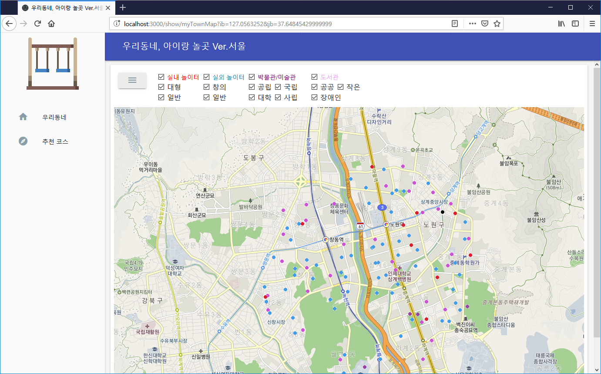

## 우리동네, 아이랑 놀곳 Ver.서울 ##

이 웹사이트 소스는 웹 개발을 쉽게 하기 위해 제작한 [Project9 Express](https://github.com/gujc71/project9_exp) (Node.js Express + MariaDB) 버전을 기반으로 제작하였다.

서울 시내 아이랑 갈만한 장소들을 모아서 보여 주는 웹 사이트(NodeJS + MariaDB)로

지원하는 장소는 다음과 같고, 장소 데이터는 제공되지 않는다.

- 실내 놀이터(키즈카페): http://www.localdata.kr/
- 실외 놀이터: http://www.cpf.go.kr/front/sub01/sub0101.do#
  창의 놀이터: https://map.seoul.go.kr
- 박물관/과학관: https://www.data.go.kr/dataset/15017323/standard.do
- 도서관: https://data.seoul.go.kr/dataList/datasetView.do?infId=OA-15480&srvType=S&serviceKind=1&currentPageNo=1

### FEATURES ###

- 우리 동네: 지정된 좌표(위도, 경도)를 중심으로 2Km 내의 시설/장소 정보 표시
- 추천 코스: 사용자가 특정 장소를 중심으로 갈만한 코스를 정리해서 소개

### Install & Run ###

- git clone https://github.com/gujc71/playground2.git
- npm install
- set the information in the "/routes/mysqlConn.js" to connect to MariaDB
- create tables by running tables.sql from MariaDB
- set the API Key in the ".env" to connect to Daum Map 
- npm start

### License ###
GPLv3